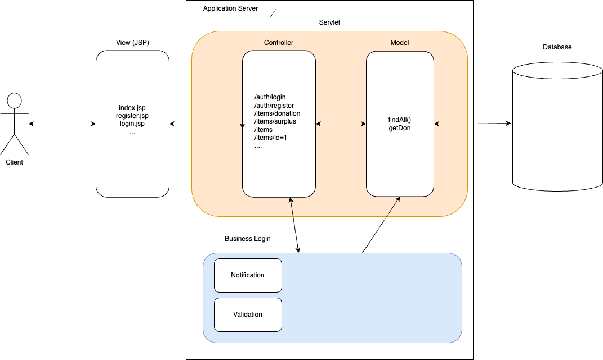

# Design Document for Food Waste Reduction Platform

Model      - assignee: 

View       - assignee:

Controller - assignee:

### Architecture

### Entities

Item: id, name, price, expiry_date, status, discount_rate, category_id

Category: id, name

Users: id, name, email, phone, password, role

Preferences: user_id, category_id

Notification: user_id, type, topic, message (not sure)

### Classes:

#### User
- User
- Retailed -> User : addItems(), updateQuantity(), setExpiryDate()
- Charitable Org -> User: claim();
- Consumer -> User;

------------

#### Item;
- Item;
  
- DiscountedItemDTO;

- DonationItemDTO;

------
#### Utils 

- Notifications

- Validations

### Patterns

Observer

---

Program requirements

### 01 - User Registration

1. Ability to create account on platform by providing
   1. name
   2. email
   3. password
   4. selecting a user type of
      1. retailer
      2. consumer
      3. charitable organization
2. Authentication by allowing to user to
   1. log in
   2. log out

### 02 - Retailers

1. Inventory management capability by allowing the user to
   1. add items
   2. update quantities of items
   3. set exp dates for each item
2. Identify surplus items by expiry date
   1. if expiry date is within one week of current day the food is considered surplus
3. list surplus food items to platform for donation or a discount price
   1. retailer can select reduced price
   2. retailer inventory must update after food is purchased or donated

### 03 - Charitable Organization

1. Claim food items listed for donation by retailers

### 04 - Consumers

1. Can purchase items listed by retailers

### Additional Functionality

1. User Subscription
   1. can subscribe to receive surplus food alerts based on their
      1. location
      2. communication method
         1. email
         2. phone (either or)
      3. food preferences
2. Automatic Notifications
   1. users subscribed to alerts are notified when retailers list surplus food items on the platform
3. Bonus Functionality
   1. we must introduce one functionality of our own design

### DataBase

1. Use a relational database
2. Title the system FWRP
3. Design schema by introducing entities that are required
